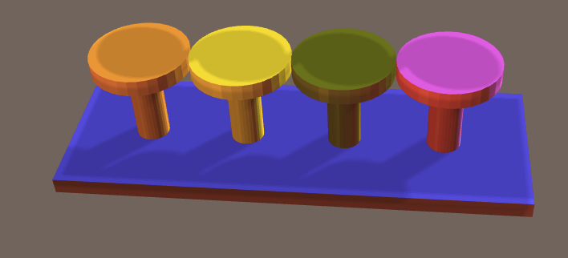

craft-board
===========

Board that can hold stuff above.

# Install

    $ npm install craft-board

# Example

```html
<craft>
    <craft name="pin" module="craft-pin"/>
    <craft name="board" module="craft-board"/>      
    <board>
        <pin></pin>
        <pin></pin>
        <pin></pin>
        <pin></pin>    
    </board>
</craft>
``` 


